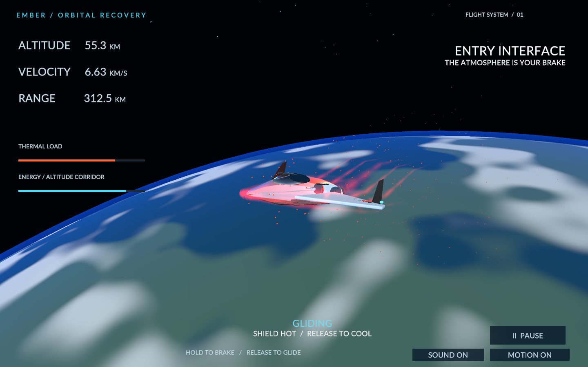

# EMBER — Return to Earth

A complete one-button orbital recovery game, built with Unity 6 and an original Blender lifting-body spacecraft.

**[Play in your browser](https://stevenli-phoenix-work.itch.io/ember-reentry)**

Hold **Space, mouse or touch** to raise the nose and brake. Release to cool the heat shield and preserve range. Bring the spacecraft to Aster within 18 km of the target, below 0.85 km/s. Excess heat, excess landing energy, undershooting and overshooting have distinct outcomes. Three missions offer different atmospheric drag and lighting. Escape pauses; sound and camera motion can be disabled.

The flight is intentionally time-compressed and tuned for play, rather than engineering accuracy. No runtime AI, network connection, account or paid service is required.

## Source and assets

- `Reentry/`: Unity 6000.6.0f1, URP 17.6.0, Input System, static TextMeshPro fonts.
- `art/Ember.blend`: editable original Blender model: ceramic fuselage, delta wings, canopy, thermal tiles, twin engines and navigation lights.
- `art/build_assets.py`: reproducible Blender FBX export and model render.
- `Reentry/Assets/Scripts/`: deterministic flight model, game flow, visuals, HUD and synthesized audio.

## Build and verify

```sh
bash scripts/build.sh Desktop
bash scripts/build.sh Web
node --test scripts/*.test.mjs
dotnet run --project tests/FlightChecks.csproj
node scripts/serve.mjs
```

Build output goes to `Reentry/Build/`. Set `UNITY_EDITOR` to override the local Unity executable. Every Unity build runs the flight regression suite first. The native player accepts `--qa` to run a winning trajectory and capture title, entry, approach and debrief to `/tmp/ember-*.png`; QA never saves a best score.

GitHub Actions executes the same pure C# flight tests and Node bundle-validator regressions. Rendering and audio are also checked in actual Unity players and WebGL separately.

## Credits

Game design, code and procedural art authored with Codex assistance for Steven Li. Lato by the Lato project (SIL OFL, included). TextMeshPro resources retain their Unity package notices. Development guidance: [awesome-gamedev-agent-skills](https://github.com/gamedev-skills/awesome-gamedev-agent-skills), particularly Unity scripting, game feel and build/publishing workflows. No third-party spacecraft or music assets.
