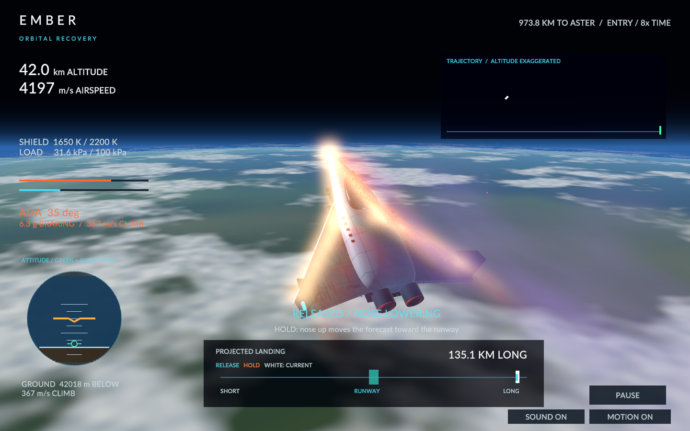

# EMBER — Return to Earth

A complete one-button orbital recovery game, built with Unity 6 and an original Blender lifting-body spacecraft.

**[Play in your browser](https://stevenli-phoenix-work.itch.io/ember-reentry)** · **[Desktop releases](https://github.com/StevenLi-phoenix/unity-space-reentry/releases)**

Local browser builds are written to `Reentry/Build/WebGL`. See [publishing instructions](docs/PUBLISHING.md) for the automated release workflow.

Hold **Space, mouse or touch** to raise the nose and brake. Release to lower the nose and descend. Reach the 500m autoland capture gate within 2km of the predicted touchdown point, below 180m/s and 35m/s descent. Excess heat, excess landing energy, undershooting and overshooting have distinct outcomes. Three missions offer different destination ranges and lighting. Escape pauses; sound and camera motion can be disabled.

The flight is intentionally time-compressed and tuned for play, rather than engineering accuracy. No runtime AI, network connection, account or paid service is required.

## Source and assets

- `Reentry/`: Unity 6000.6.0f1, URP 17.6.0, Input System, static TextMeshPro fonts.
- `art/Ember.blend`: editable original Blender model: ceramic pressure shell, framed glazing, reinforced wing roots, RCC leading edges, hollow OMS bells, hinged elevons and articulated tricycle gear.
- `art/build_assets.py`: reproducible Blender FBX export and model render.
- `Reentry/Assets/Scripts/`: deterministic flight model, game flow, visuals, HUD and synthesized audio.

## Build and verify

```sh
bash scripts/build.sh Desktop
bash scripts/build.sh Web
node --test scripts/*.test.mjs
dotnet run --project tests/FlightChecks.csproj
node scripts/serve.mjs
```

Build output goes to `Reentry/Build/`. Set `UNITY_EDITOR` to override the local Unity executable. Every Unity build runs the flight regression suite first. The native player accepts `--qa` to run a winning trajectory and capture title, entry, approach and debrief to `/tmp/ember-*.png`; QA never saves a best score. `--visual-qa` captures the entry/ground/final visual fixtures; `--landing-qa` captures the landing stages.

GitHub Actions runs C# flight, landing and debrief regressions plus Node bundle and release packaging tests. Main builds and validates WebGL, then deploys to itch.io. Version tags build WebGL, Universal macOS, Windows x64 and Linux x64 packages and publish them to GitHub Releases with SHA-256 checksums. The tag must match `PlayerSettings.bundleVersion`; build scripts preserve that version. Rendering and audio are checked separately in actual Unity players and WebGL.

## Presentation

Volumetric leading-edge plasma, a permanent coastal landscape and an attitude/flight-path instrument make heating, altitude and motion readable. Altitude-aware reflections and separate surface smoothness maps distinguish ceramic, carbon, metal and glass. The accepted approach now continues through flare, main-wheel touchdown, nose lowering, tire spin-up, speedbrakes and a braking rollout to a complete stop. See [the visual audit](docs/VISUAL-AUDIT.md) for the earlier fixes and [airframe/landing notes](docs/AIRFRAME-LANDING.md) for this pass.

## Credits

Game design, code and procedural art authored with Codex assistance for Steven Li. Lato by the Lato project (SIL OFL, included). TextMeshPro resources retain their Unity package notices. Development guidance: [awesome-gamedev-agent-skills](https://github.com/gamedev-skills/awesome-gamedev-agent-skills), particularly Unity scripting, game feel and build/publishing workflows. No third-party spacecraft or music assets.

Earth texture: NASA/Goddard Space Flight Center Scientific Visualization Studio, [Blue Marble](https://svs.gsfc.nasa.gov/2915); data courtesy Reto Stockli and NASA Earth Observatory.
