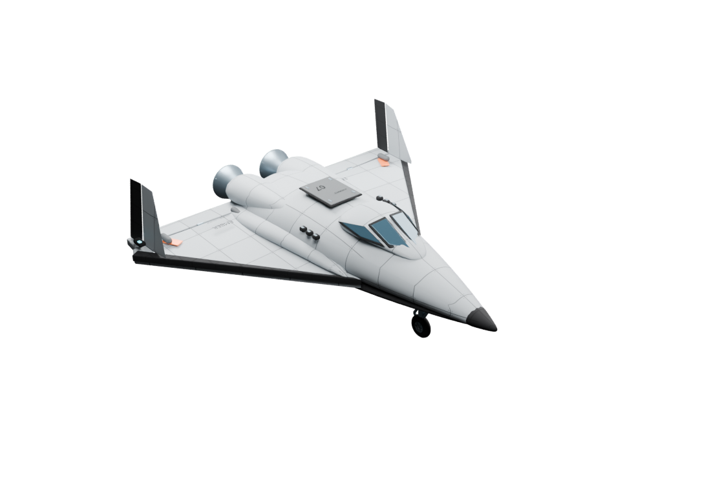
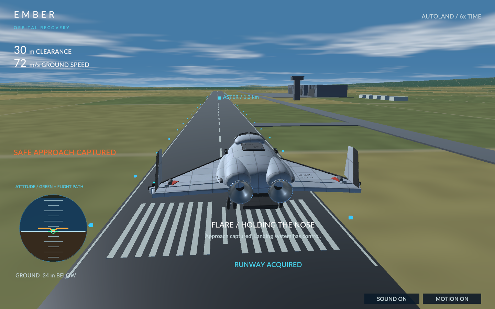
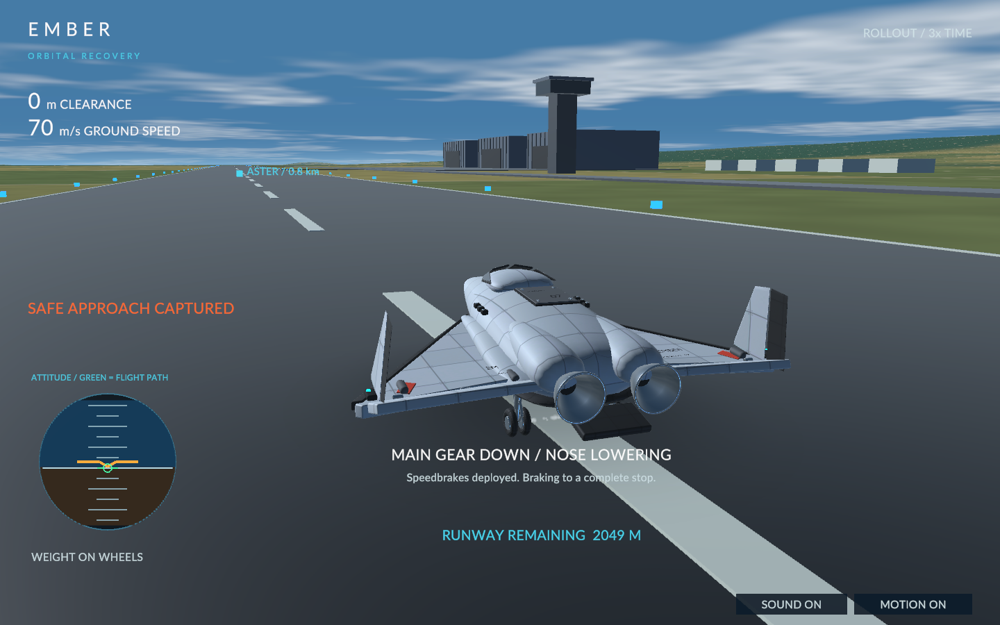
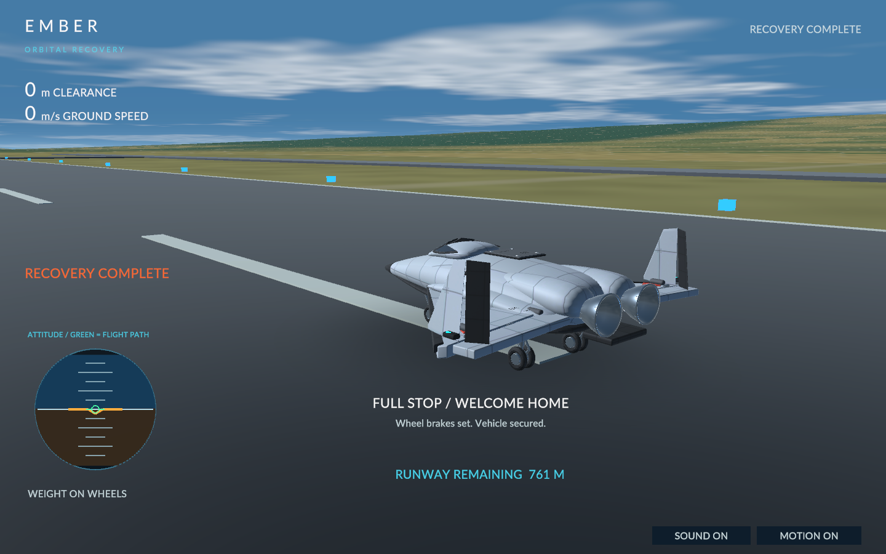

# Airframe and landing polish

The player rated the previous build 95/100 and requested more convincing spacecraft construction, lighting and surface detail, plus animated control surfaces and a complete landing. FlightModel integration, controls, energy gate and scoring are unchanged.

## Aircraft

The editable Blender model now has a pressure fairing and individually framed cockpit panes, reinforced wing-root fairings, separate carbon leading edges, an avionics access cover with latches, supported OMS housings, hollow ribbed nozzle bells, and a tricycle gear assembly with oleo cylinders, drag braces, torque links, wheel hubs and paired main tires. The elevons, body flap, split wingtip drag rudders, gear and bay doors use exported named pivots. Static material joining excludes animated descendants.

This remains an original fictional lifting body. The visual construction references are NASA's [shuttle aeronautics overview](https://www.nasa.gov/centers-and-facilities/langley/the-aeronautics-of-the-space-shuttle/) and [thermal protection overview](https://www.nasa.gov/history/sts1/pages/tps.html): distinct control surfaces, carbon nose/leading edges and differentiated thermal surfaces. No NASA spacecraft mesh is used.

The reflection environment blends dark orbital sky and bright Earth into daylight as altitude falls. Separate linear smoothness maps preserve rough thermal ceramics while glass and machined metal retain sharper highlights. Reflection mip levels soften rough surfaces without six extra rendering cameras. These are authored environmental reflections, not screen-space or ray-traced reflections.

## Landing

After FlightModel accepts the approach, a separate deterministic presentation sequence integrates forward travel, flares to main-wheel contact, lowers the nose and brakes. Touchdown is 800m before runway center; 70m/s and 1.9m/s² braking yield a 1,289m rollout and stop with 761m of runway remaining. Approach is shown at 6x and rollout at 3x time, labelled in the HUD. A flight may enter the sequence at a different accepted gate speed or range; capture position and speed remain continuous.

Elevons respond to actual AOA, gear rotates from its bays, and wheel rotation follows distance divided by tire radius. The nose wheel starts rotating after nose contact. Touchdown emits a brief tire puff and spin-up sound, followed by speed-dependent rolling rumble. The camera smoothly moves to a rear-quarter view; reduced-motion mode retains the fixed chase view. Stale thermal and prediction panels disappear during landing. The debrief waits for a full stop.

## Checks

- Unchanged three-route physical regression and presentation tests.
- Landing tests sample nine accepted speed/range combinations, checking continuous capture and touchdown, forward travel, nonnegative speed, stage order, runway containment and stable stop. Ground displacement derivatives agree with displayed rollout speed.
- Unity checks require the imported movable pivots and geometry, the PBR maps, reflection brightness ordering and finite bounded contact audio.
- Native `--visual-qa`, `--landing-qa` and full `--qa` exercise visual fixtures, stage transitions and the real flight separately. QA fixtures never save best scores.

The native full-flight run captured a safe approach at 73.51m/s, passed every landing stage, reached 0m/s and then captured the debrief. The dedicated landing fixture also completed without runtime exceptions.

Final WebGL build passed all build-time suites. Chrome Work rendered the updated airframe with the gear stowed. The local server returned HTTP 200; served data (10,503,449 bytes) and WASM (9,640,500 bytes) matched the final build byte-for-byte. The accepted FlightModel source is byte-identical to the previous commit.
