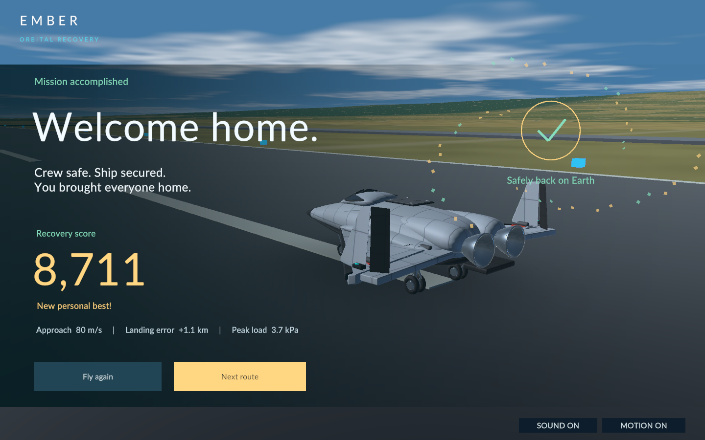

# Welcome home

The success result now celebrates returning safely: a brighter parked spacecraft, a large “Welcome home.” headline, warm gold recovery score, mint completion emblem and one brief star burst. Actual flight data stays in a compact secondary row. “Fly again” and the gold “Next route” button continue the existing actions.

The score counts to the exact earned total over 1.15 seconds. A genuine personal-best result gets its own label. Reduced motion immediately completes the reveal and removes the burst; changing the setting cannot restart the count. A cached ascending major-chord cue plays once after the aircraft has stopped, with the ambient music briefly quieter. Muting remains effective.

Failure messages retain their flight-recorder layout. The flight simulation, landing sequence and scoring are unchanged. Retry now refreshes its starting instrument readings immediately.

Verification uses deterministic score-reveal checks, bounded audio samples with silent endpoints, and native screenshots of success, failure and reduced-motion success. Every build also runs the existing flight, landing and presentation suites.

The final native fixtures passed for animated success, reduced-motion success and failure. Button labels were inspected at full resolution. Both buttons retain their existing actions. Native and WebGL builds passed the regression suites; the local preview returned HTTP 200 and served data/WASM matched the final build byte-for-byte.
