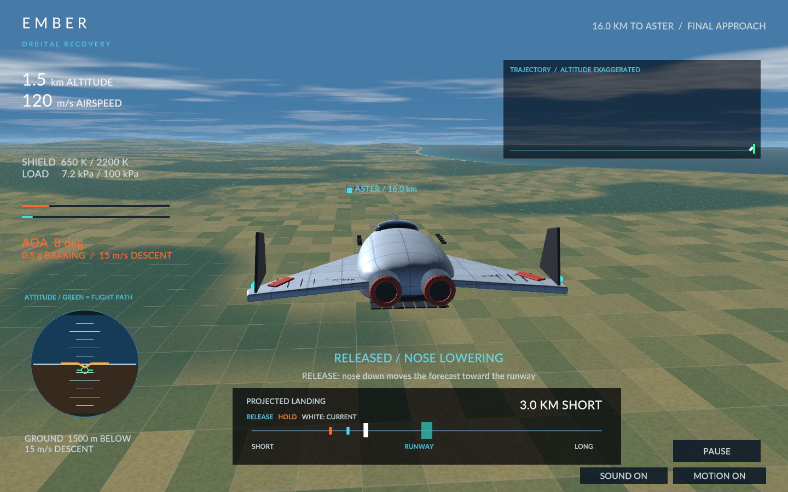
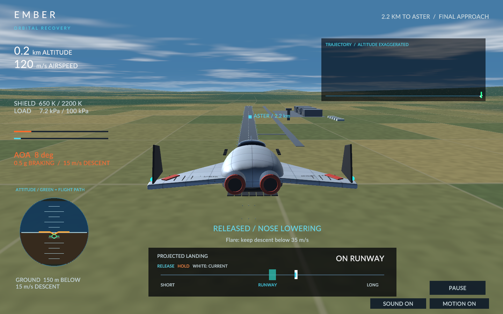

# Visual and usability audit — September 20, 2026

The player rated the preceding build 85/100 and accepted the one-button physical core. This pass leaves FlightModel integration and scoring unchanged.

## Findings and changes

- Plasma was a transparent geometric shell with a clearly visible border. Replaced it with a bounded volume that integrates turbulent gas density along the view ray, with white-orange leading edges and cooler violet wake. Sources move with the ship; convection follows flight direction.
- Flight lacked close ground references. Added a permanent curved coastal terrain mesh with fields, hills, roads and shoreline; kept the runway at its measured scale. Removed the old oversized flat base slab that hid the terrain near the airport.
- The landing camera's sideways offset made a centered aircraft look misaligned. It now converges on the centerline during approach.
- Command labels described input as physical motion and could say descending during a climb. Actual vertical velocity now determines climb/descent labels. Added an attitude/flight-path reference and height above the clear approach corridor.
- The runway marker showed through Earth. It now respects the spherical horizon.
- Guidance assumed holding always increased range. It now compares the two actual forecasts before recommending input; forecasts have a color legend.
- Clicking a HUD control could also raise the nose. Pointer commands are suppressed for UI gestures while keyboard input remains independent.
- Shader time and ablation particles advanced while paused. The plasma uses an explicit simulation-time material parameter; particles pause with the flight.
- The atmosphere gradient was vertically inverted on the macOS render target. Corrected its screen coordinate handling and exposed altitude/horizon material parameters.
- Each control transition played a half-second outcome jingle and allocated audio. Commands now use cached short servo cues. Muting also silences already-playing telemetry audio.
- Autoland displayed frozen approach readings and stale manual-control advice. It now reports its visual altitude and landing-system status.
- Failure debriefs called high-altitude terminal speed “approach speed” and used the wrong reason for skipping. Labels/reasons now match the outcome.

## Reference and validation

Visual direction: the user's KSP screenshot and [Firefly](https://github.com/M1rageDev/Firefly). Implementation is original; no KSP or Firefly assets/code were copied.

Pure presentation regression checks cover climb/descent, UI input gating, horizon occlusion, reversed forecast response and terrain constraints. Unity asset checks cover the closed gas volume, terrain coverage, shader material parameters and audio headroom. The unchanged flight regression suite exercises three successful routes and failure cases. Native `--visual-qa` covers high-AOA plasma, coastal approach and runway height; `--qa` exercises a full actual flight.

Final verification: native full flight captured a successful landing at 73.51m/s. Native and WebGL builds passed all build-time checks. Chrome Work rendered the plasma and atmosphere; runtime logs confirmed pause/resume and the expected no-input failure. The final served WASM was compared byte-for-byte with the built artifact (9,635,297 bytes), and the page returned HTTP 200.
